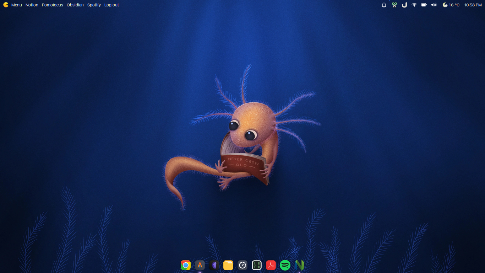

# Linux Setup :
Author: Erick Avila | @ErickAvilaB
***

## Table of Contents
1. [Distribution](#distribution)
2. [Hour](#hour)
3. [Update and Upgrade](#update)
4. [Chrome](#chrome)
5. [Git installation and configuration](#git)
6. [Ssh Key](#ssh)
7. [Z shell](#zsh)
8. [Alacritty](#alacritty)
9. [Nvim](#nvim)
10. [Customization](#Customization)
11. [Plank icon dock](#Plank)
12. [Ulauncher](#Ulauncher)
13. [Extra](#extra)
***

## Distribution
Xubuntu is an Ubuntu flavour. Download the **Supported LTS release: 20.04, Focal Fossa** ISO from the [official page](https://xubuntu.org/).
***

## Hour
Dual boot with Window and Linux has problem with the hour, to solve that first **set right hour in window** the run:
~~~
$ timedatectl set-local-rtc 1 --adjust-system-clock
~~~
***

## Create workspace folder
~~~
$ cd
$ mkdir workspace
~~~

## Update and Upgrade
`$ sudo apt update && sudo apt upgrade`
***

## Install Chrome
For chrome installation we need go to [official chrome web site](https://www.google.com/intl/es-419/chrome/), then download the .deb. Open a terminal in the download directory, run the command `$ sudo dpkg -i <package name>`.
***

## Install git
[Guide](https://git-scm.com/download/linux)  
Install git with: `$ sudo apt-get install git`.
***

## Git config
[Guide](https://git-scm.com/book/es/v2/Inicio---Sobre-el-Control-de-Versiones-Configurando-Git-por-primera-vez)  
Git generate a file config where is located all user and global settings, to access that file run at terminal `$ git config --global -e`. There copy the next content:
~~~
# This is Git's per-user configuration file.
[user]
	name  = Erick Avila
	email  = yahir7083@gmail.com
[core]
	editor  = nvim
	autocrlf = input
[color]
	ui  = true
[help]
	autocorrect  = 1
[init]
	defaultBranch = main
~~~
***

## SSH
[Guide](https://git-scm.com/book/es/v2/Git-en-el-Servidor-Generando-tu-clave-p%C3%BAblica-SSH)
Create an ssh key and add it to GitHub.
~~~
$ cd
$ mkdir .ssh
$ cd .ssh
$ ssh-keygen
$ ssh-add ~/ssh/<name private key>

# Add public key to GitHub(file ends .pub)
~~~

## Install ZSH and ho my zsh
[Zsh guide](https://github.com/ohmyzsh/ohmyzsh/wiki/Installing-ZSH) | [Ho my zsh guide](https://ohmyz.sh/)  

File configuration: [**zsh.rc**](https://github.com/ErickAvilaB/linux-setup/blob/master/assets/.zshrc)
~~~
# Install zsh
$ sudo apt install zsh

# Init zsh, then press 0 and exit
$ zsh

# Make zsh the default shell. Restart.
$ chsh -s $(which zsh)

# After restart install ho my zsh
$ sh -c "$(curl -fsSL https://raw.github.com/ohmyzsh/ohmyzsh/master/tools/install.sh)"
~~~

### Install zsh plugins
Some plugins for improve zsh experience.

#### Autosuggestion
[Guide](https://github.com/zsh-users/zsh-autosuggestions/blob/master/INSTALL.md#oh-my-zsh)  
Download:
~~~
$ git clone https://github.com/zsh-users/zsh-autosuggestions ${ZSH_CUSTOM:-~/.oh-my-zsh/custom}/plugins/zsh-autosuggestions
~~~
Add to .zshrc:
~~~
plugins=(
	zsh-autosuggestions
)
~~~

#### Syntax
[Guide](https://linuxhint.com/enable-syntax-highlighting-zsh/)  
Download:
~~~
$ git clone https://github.com/zsh-users/zsh-syntax-highlighting.git ${ZSH_CUSTOM:-~/.oh-my-zsh/custom}/plugins/zsh-syntax-highlighting
~~~
Add to .zshrc:
~~~
plugins=(
	zsh-syntax-highlighting
)
~~~

#### Autopair
[Guide](https://github.com/hlissner/zsh-autopair)
Download:
~~~
$ git clone https://github.com/hlissner/zsh-autopair ${ZSH_CUSTOM:-~/.oh-my-zsh/custom}/plugins/zsh-autopair
~~~
Add to .zshrc
~~~
plugins=(
	zsh-autopair
)
~~~

#### Typewritten
[Guide](https://typewritten.dev/#/)  
Download:
~~~
$ git clone https://github.com/reobin/typewritten.git $ZSH_CUSTOM/themes/typewritten
~~~
Add theme to .zshrc:
~~~
ZSH_THEME="typewritten/typewritten"

# Config cursor style
TYPEWRITTEN_PROMPT_LAYOUT="pure"
TYPEWRITTEN_ARROW_SYMBOL="➜"

# Config theme colors
TYPEWRITTEN_COLOR_MAPPINGS="primary:#A5ABCB;secondary:#89DDFF;accent:#89DDFF;info_negative:#F07178;info_positive:#C3E88D"
~~~

### JSON tools
[Guide](https://github.com/ohmyzsh/ohmyzsh/tree/master/plugins/jsontools)
Download:
~~~
$ git clone https://github.com/ErickAvilaB/zsh-json.git ${ZSH_CUSTOM:-~/.oh-my-zsh/custom}/plugins/zsh-json
~~~
Add to .zshrc
~~~
plugins=(
	jsontools
)
~~~

### CFLASK
Download:
~~~
$ git clone https://github.com/ErickAvilaB/cflask.git ~/
~~~
Then create alias to main.sh(~/cflask/main.sh) on .zshrc `alias cfl="sh ~/cflask/main.sh"`
***

## Alacritty terminal
Install with the next [video](https://www.youtube.com/watch?v=9ttxDIolNBo)  
Configuration file: [**alacritty.yml**](https://github.com/ErickAvilaB/linux-setup/blob/master/assets/alacritty.yml)

### Install Nerd Font
[Download JetBrainsMono Nerd Font](https://www.nerdfonts.com/font-downloads)  
Install:
~~~
$ mkdir JetBrainsMono
$ mv <package name> JetBrainsMono
$ cd JetBrainsMono

# In zip file directory
$ unzip <package name>
$ sudo mv * /usr/share/fonts/
~~~
***

## Install NeoVim
[Guide](https://github.com/neovim/neovim/wiki/Installing-Neovim)  
~~~
# Install from snap

$ sudo snap install nvim --classic
~~~
***

### Install vim plug
[Guide](https://github.com/junegunn/vim-plug)  
~~~
$ sh -c 'curl -fLo "${XDG_DATA_HOME:-$HOME/.local/share}"/nvim/site/autoload/plug.vim --create-dirs \
       https://raw.githubusercontent.com/junegunn/vim-plug/master/plug.vim'
~~~

### Connect python and node with nvim

#### Python
[Guide](https://github.com/neovim/pynvim)  
~~~
# Install pip
$ sudo apt-get install python3-pip

# Install pynvim
$ pip3 install pynvim
$ pip3 install --upgrade pynvim
~~~

### Node
[Guide](https://github.com/nvm-sh/nvm) | [NPM Neovim](https://www.npmjs.com/package/neovim/v/0.0.1)
~~~
# Install node through nvm
# Install nvm
$ curl -o- https://raw.githubusercontent.com/nvm-sh/nvm/v0.39.3/install.sh | bash

# Update zsh
$ source ~/.zshrc

# Install node
$ nvm install --lts

# Install node neovim
$ npm install -g neovim
~~~

### Config nvim
[Guide](https://github.com/ErickAvilaB/nvim)
~~~
$ cd
$ cd .config/
$ git clone git@github.com:ErickAvilaB/nvim.git
$ cd nvim
$ mkdir plugged
~~~

After open plugins.vim and run  `:PlugUpgrade`, `:PlugInstall`, `:PlugUpdate`.

#### Dependencies
[COC](https://github.com/neoclide/coc.nvim) | [PEP8](https://pypi.org/project/autopep8/) | [FZF](https://github.com/junegunn/fzf.vim) | [Copilot](https://github.com/github/copilot.vim) | [Prettier](https://github.com/prettier/vim-prettier) | [Tab Nine](https://github.com/neoclide/coc-tabnine#install)  
- COC
~~~
:CocInstall coc-pyright
:CocInstall coc-html
:CocInstall coc-css
:CocInstall coc-tsserver
~~~

- Tab Nine
~~~
:CocInstall coc-tabnine

# add "ignore_all_lsp": true
:CocCommand tabnine.openConfig
:CocCommand tabnine.openHub
~~~

- PEP8
~~~
$ pip install --upgrade autopep8
~~~

- Pylint
~~~
$ pip install pylint
~~~

- Prettier
~~~
$ cd .config/nvim/plugged/vim-prettier
$ npm install
~~~

- Markserv
~~~
$ npm i -g markserv
~~~

- Live Server
~~~
$ npm install -g live-server
~~~

- FZF
~~~
# Install bat
$ sudo apt install bat

# AG
$ sudo apt-get install silversearcher-ag
~~~

- Copilot  
Run `:Copilot setup`, login on GitHub and paste the code.
***

## Customization
### Themes
For install themes first we need to create two folders in /home/<user>/directory, the first will be called **.icons** and the second **.themes**
~~~
$ cd
$ mkdir .icons
$ mkdir .themes
~~~

#### Install icon theme

Go to this [site](https://www.xfce-look.org/p/1340791) and download the theme called **Reversal-blue.tar.xz**. Then run the commands:
~~~
$ sudo mv Downloads/<package name> ~/.icons
$ cd .icons
$ tar -xvf <package name>
$ gtk-update-icon-cache /home/<user>/.icons/<package name>
$ sudo rm <package name>
~~~

Settings > Appearance > Icons; and select **Reversal**  

### Windows theme
Go to this [site](https://www.xfce-look.org/p/1687249/) and download the theme called **Dracula.tar.xz**. Then run the commands:
~~~
$ sudo mv Downloads/<package name> ~/.themes
$ cd .themes
$ tar -xvf <package name>
$ sudo rm <package name .tar>
~~~

Settings > Appearance > Style; and select **Dracula**  
Settings > Appearance > window manager; and select **Dracula**

### Change font
[Download font](https://www.dafontfree.io/download/san-francisco-text/?wpdmdl=64309&refresh=62615668b4aad1650546280&ind=1601919915418&filename=1601919916wpdm_San-Francisco.zip)
~~~
$ unzip San-Francisco.zip
$ cd San Francisco/SFUIDisplay/
$ sudo mv * /usr/share/fonts
~~~

Disable custom dpi. Settings > Desktop > Icons > Appearance > Custom DPI: None  
Disable desktop icons. Settings > Desktop > Icons > Appearance > Icon type: None  

### Cursor
Go to this [site](https://www.xfce-look.org/p/1356095) and download the theme called **volantes_cursors.targz**. Then run the commands:
~~~
$ sudo mv Downloads/<package name> ~/.icons
$ cd .icons
$ tar -xvf <package name>
$ sudo rm <package name .tar>
~~~
Settings > Mouse > Theme; and select **volantes_cursors**  

## Plank
~~~
$ sudo apt install plank
~~~
Add to startup. Go to Settings > Session and Start Up > Applications > Add; fill whit plank.

## Ulauncher
[Guide](https://ulauncher.io/#)
~~~
$ sudo add-apt-repository ppa:agornostal/ulauncher && sudo apt update && sudo apt install ulauncher
~~~

### Install theme for Ulauncher
[Install Zorin theme](https://github.com/NayamAmarshe/ulauncher-zorinBlueDark)
Downloads with:
~~~
$ git clone https://github.com/NayamAmarshe/ulauncher-zorinBlueDark/ \
  ~/.config/ulauncher/user-themes/zorin-blue-dark

# Then select the theme into config panel.
~~~

### Shortcuts
- Super + H | alacritty --command htop

## Some extra things
~~~
# Install stacer
$ sudo apt install stacer

# Install flask
$ pip install Flask

# Install venv
$ pip install virtualenv
$ sudo apt install python3.8-venv

# Install neofetch
$ sudo apt install neofetch

# Install htop
$ sudo apt install htop

# Install okular
$ sudo snap install okular
~~~

## Example

(ﾉ◕ヮ◕)ﾉ*:･ﾟ✧
