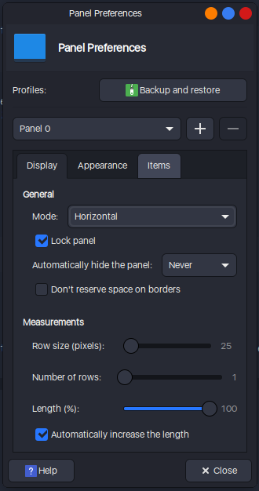

# Linux Setup :
Author: Erick Avila | @ErickAvilaB on GitHub
***

## Table of Contents
1. [Distribution](#distribution)
2. [Initial settings](#initial-settings)
	* [WiFi](#wifi)
	* [Hour](#hour)
3. [Update and Upgrade](#update)
4. [Install Chrome](#chrome)
5. [Install Git](#git)
	* [Git config](#git-config)
	* [SSH key](#ssh)
6. [Install zsh](#zsh)
	* [ZSH plugins](#zsh-plugins)
	* [ZSH config](#zsh-config)
7. [Xfece terminal](#xfce-terminal)
8. [Install tmux](#tmux)
9. [Install NeoVim](#nvim)
10. [Customization](#Customization)
11. [Plank](#Plank)
12. [Ulauncher](#Ulauncher)
13. [Extra](#extra)
***

## Distribution
I use Linux lite, it's a Ubuntu's child. Download ISO from the [official page](https://www.linuxliteos.com/download.php) and boot with [Rufus](https://rufus.ie/es/).
***

## Initial settings

### WiFi
[Guide](https://askubuntu.com/questions/1030653/wifi-randomly-disconnected-on-ubuntu-18-04-lts)  
I've got problems with WiFi, it randomly shutdown and it's necessary restart the PC to get WiFi back.
For solve it run at terminal:
~~~
$ sudo nano /etc/NetworkManager/conf.d/default-wifi-powersave-on.conf
~~~
And change `wifi.powersave = 3` to `wifi.powersave = 2`.

### Hour
I've got problems whit hour too, it mistakenly change.Run the next command at terminal to solve it:
~~~
$ timedatectl set-local-rtc 1 --adjust-system-clock
~~~
***

### Create workspace folder
~~~
$ cd
$ mkdir workspace
~~~

## Update and Upgrade
Here we are going to update and upgrade. Just run the follow command:`$ sudo apt update && sudo apt upgrade`
***

## Install Chrome
For chrome installation we need go to [official chrome web site](https://www.google.com/intl/es-419/chrome/), then download the .deb. Open a terminal in the download directory, run the command `$ sudo dpkg -i <package name>`.
***

## Install git
[Guide](https://git-scm.com/download/linux)  
Git is a fundamental tool for development, so let's install it: `$ sudo apt-get install git`.
***

## Git config
[Guide](https://git-scm.com/book/es/v2/Inicio---Sobre-el-Control-de-Versiones-Configurando-Git-por-primera-vez)  
Git generate a file config where is located all user and global settings, to access that file run at terminal `$ git config --global -e`. There copy the next content:
~~~
# This is Git's per-user configuration file.
[user]
	name  = Erick Avila
	email  = yahir7083@gmail.com
# Please adapt and uncomment the following lines:
# name = erick
# email = erick@erick.(none)
[core]
	editor  = nvim
	autocrlf = input
[color]
	ui  = true
[help]
	autocorrect  = 1
[init]
	defaultBranch = main
~~~
***

## SSH
[Guide](https://git-scm.com/book/es/v2/Git-en-el-Servidor-Generando-tu-clave-p%C3%BAblica-SSH)
Create an ssh key and add it to GitHub.
~~~
$ cd
$ mkdir .ssh
$ cd .ssh
$ ssh-keygen

# Add public key to GitHub

$ ssh-add ~/ssh/<name private key>
~~~

## Install ZSH and ho my zsh
[Zsh guide](https://github.com/ohmyzsh/ohmyzsh/wiki/Installing-ZSH) | [Ho my zsh guide](https://ohmyz.sh/)  
~~~
# Install zsh
$ sudo apt install zsh

# Init zsh, then press 0 and exit
$ zsh

# Make zsh the default shell. Restart.
$ chsh -s $(which zsh)

# After restart install ho my zsh
$ sh -c "$(curl -fsSL https://raw.github.com/ohmyzsh/ohmyzsh/master/tools/install.sh)"
~~~

### Install zsh plugins
Some plugins for improve zsh experience.

#### Autosuggestion
[Guide](https://github.com/zsh-users/zsh-autosuggestions/blob/master/INSTALL.md#oh-my-zsh)  
Download:
~~~
$ git clone https://github.com/zsh-users/zsh-autosuggestions ${ZSH_CUSTOM:-~/.oh-my-zsh/custom}/plugins/zsh-autosuggestions
~~~
Add to .zshrc:
~~~
plugins=(
	zsh-autosuggestions
)
~~~

#### Syntax
[Guide](https://linuxhint.com/enable-syntax-highlighting-zsh/)  
Download:
~~~
$ git clone https://github.com/zsh-users/zsh-syntax-highlighting.git ${ZSH_CUSTOM:-~/.oh-my-zsh/custom}/plugins/zsh-syntax-highlighting
~~~
Add to .zshrc:
~~~
plugins=(
	zsh-syntax-highlighting
)
~~~

#### Autopair
[Guide](https://github.com/hlissner/zsh-autopair)
Download:
~~~
$ git clone https://github.com/hlissner/zsh-autopair ${ZSH_CUSTOM:-~/.oh-my-zsh/custom}/plugins/zsh-autopair
~~~
Add to .zshrc
~~~
plugins=(
	zsh-autopair
)
~~~

#### Typewritten
[Guide](https://typewritten.dev/#/)  
Download:
~~~
$ git clone https://github.com/reobin/typewritten.git $ZSH_CUSTOM/themes/typewritten
~~~
Make symlink:
~~~
$ ln -s "$ZSH_CUSTOM/themes/typewritten/typewritten.zsh-theme" "$ZSH_CUSTOM/themes/typewritten.zsh-theme"

$ ln -s "$ZSH_CUSTOM/themes/typewritten/async.zsh" "$ZSH_CUSTOM/themes/async"
~~~
Add theme to .zshrc:
~~~
# Use theme
ZSH_THEME="typewritten/typewritten"

# Config cursor style
TYPEWRITTEN_PROMPT_LAYOUT="pure"

# Config theme colors
TYPEWRITTEN_COLOR_MAPPINGS="primary:#A1A7B4;secondary:#BB77D9;accent:#BB77D9;info_negative:#D96C80;info_positive:#98C379"
~~~

### JSON tools
[Guide](https://github.com/ohmyzsh/ohmyzsh/tree/master/plugins/jsontools)
Download:
~~~
$ git clone https://github.com/ErickAvilaB/zsh-json.git ${ZSH_CUSTOM:-~/.oh-my-zsh/custom}/plugins/zsh-json
~~~
Add to .zshrc
~~~
plugins=(
	jsontools
)
~~~

### CFLASK
Download:
~~~
$ git clone https://github.com/ErickAvilaB/cflask.git ~/workspace
~~~
Then create alias to main.sh(~/workspace/cflask/main.sh) on .zshrc

### ZSH config
[File](./assets/.zshrc)
~~~
# Alias
# NeoVim Aliases
alias nv="nvim"
alias v="nvim ./"

# System aliases
alias cl="clear"
alias e="exit"
alias bat="batcat"
alias tm="tmux"
alias sns="sensors"
alias ht="htop"
alias tu="thunar"
alias xgo="xdg-open"
alias lo="lsof -i -P -n"

# Git aliases
alias gi="git init"
alias gs="git status"
alias gss="git status -s"
alias ga="git add"
alias gaa="git add -A"
alias gc="git commit -m"
alias gco="git checkout"
alias gcob="git checkout -b"
alias gbd="git branch -d"
alias gbm="git branch -m"
alias gd="git diff"
alias gds="git diff --staged"
alias gl="git log"
alias glo="git log --oneline"
alias grao="git remote add origin"
alias gpom="git push -u origin master"
alias gp="git push"
alias gf="git fetch"
alias gpl="git pull"
alias gu=updateGitRepo

function updateGitRepo() {
	git fetch
	git pull
}

# Use ctrl for move while words
bindkey "[[1;3C" forward-word
bindkey "[[1;3D" backward-word
~~~
***

## Xfce terminal
Just copy the next settings:

### 0 Install Nerd Font
[Download](https://github.com/ryanoasis/nerd-fonts/releases/download/v2.1.0/JetBrainsMono.zip)  
Install:
~~~
$ unzip <package name>
$ sudo mv *.ttf /usr/share/fonts/
~~~

### 1

### 2

### 3

- Text color: #A1A7B4  
- Background: #282C34  
- Cursor: #BB77D9  
- Selection: #BB77D9  
- Bold: #98C379
***

## Install tmux
[Ho my tmux](https://github.com/gpakosz/.tmux)  
~~~
# Install tmux
$ sudo apt install tmux

# Install ho my tmux
$ cd
$ git clone https://github.com/gpakosz/.tmux.git
$ ln -s -f .tmux/.tmux.conf
$ cp .tmux/.tmux.conf.local .
~~~
***

## Install NeoVim
[Guide](https://github.com/neovim/neovim/wiki/Installing-Neovim)  
~~~
$ sudo add-apt-repository ppa:neovim-ppa/stable
$ sudo apt-get update
$ sudo apt-get install neovim
~~~
Create a directory named **nvim** in **~/.cofig**, then create an directory named **plugged** there will save the plugins.
***

### Install vim plug
[Guide](https://github.com/junegunn/vim-plug)  
~~~
$ sh -c 'curl -fLo "${XDG_DATA_HOME:-$HOME/.local/share}"/nvim/site/autoload/plug.vim --create-dirs \
       https://raw.githubusercontent.com/junegunn/vim-plug/master/plug.vim'
~~~

### Connect python and node with nvim

#### Python
[Guide](https://github.com/neovim/pynvim)  
~~~
# Install pip
$ sudo apt-get install python3-pip

# Install pynvim
$ pip3 install pynvim
$ pip3 install --upgrade pynvim
~~~

### Node
[Guide](https://github.com/nvm-sh/nvm) | [NPM Neovim](https://www.npmjs.com/package/neovim/v/0.0.1)
~~~
# Install node through nvm
# Install nvm
$ curl -o- https://raw.githubusercontent.com/nvm-sh/nvm/v0.39.1/install.sh | bash

# Update zsh
$ source ~/.zshrc

# Install node
$ nvm install node

# Install node neovim
$ npm install -g neovim
~~~

### Config nvim
[Guide](https://github.com/ErickAvilaB/nvim)
~~~
$ cd
$ cd .config/
$ git clone https://github.com/ErickAvilaB/nvim.git
$ cd nvim
$ mkdir plugged
~~~

After open plugins.vim and run `:PlugInstall`

#### Dependencies
[COC](https://github.com/neoclide/coc.nvim) | [PEP8](https://pypi.org/project/autopep8/) | [FZF](https://github.com/junegunn/fzf.vim) | [Copilot](https://github.com/github/copilot.vim)  
- COC
~~~
:CocInstall coc-pyright
:CocInstall coc-html
:CocInstall coc-css
:CocInstall coc-tsserver
~~~

- PEP8
~~~
$ pip install --upgrade autopep8
~~~

- FZF
~~~
# Install bat
$ sudo apt install bat

# AG
$ sudo apt-get install silversearcher-ag
~~~

- Copilot  
Run `:Copilot setup`, login on GitHub and paste the code.
***

## Customization
### Themes
For install themes first we need to create two folders in /home/<user>/ directory, the first will be called **.icons** and the second **.themes**
~~~
$ cd
$ mkdir .icons
$ mkdir .themes
~~~

#### Icon theme Kora

Go to this [site](https://www.xfce-look.org/p/1166289/) and download the theme called **papirus-icon-theme-cyan-folders.tarxz**. Then run the commands:
~~~
$ sudo mv Downloads/<package name> ~/.icons
$ cd .icons
$ tar -xvf <package name>
$ gtk-update-icon-cache /home/<user>/.icons/Papirus-Dark
$ sudo rm <package name>
~~~

Now Settings > Appearance > Icons; and select **Pairus-Dark**

### Windows theme Nordic
Go to this [site](https://www.xfce-look.org/p/1253385) and download the theme called **Sweet-Dark.tarxz**. Then run the commands:
~~~
$ sudo mv Downloads/<package name> ~/.themes
$ cd .themes
$ tar -xvf <package name>
$ sudo rm <package name .tar>
~~~

Settings > Appearance > Style; and select **Sweet-Dark**
Settings > Appearance > window manager; and select **Sweet-Dark**

1

2

### Change font
[Download font](https://www.dafontfree.io/download/san-francisco-text/?wpdmdl=64309&refresh=62615668b4aad1650546280&ind=1601919915418&filename=1601919916wpdm_San-Francisco.zip)
~~~
$ unzip San-Francisco.zip
$ cd San Francisco/SFUIDisplay/
$ sudo mv . /usr/share/fonts
~~~

### Desktop

Disable desktop icons. Settings > Desktop > Icons > Appearance > Icon type: None  
Create **workspace** folder into ~/

### Cursor
Go to this [site](https://www.gnome-look.org/p/1393084/) and download the theme called **Sweet-cursors.tarxz**. Then run the commands:
~~~
$ sudo mv Downloads/<package name> ~/.icons
$ cd .icons
$ tar -xvf <package name>
$ sudo rm <package name .tar>
~~~
Settings > Mouse > Theme; and select **Sweet**  

## Panel

## Plank
~~~
$ sudo apt install plank
~~~
Add to startup. Go to Settings > Session and Start Up > Applications > Add; fill whit plank.

## Ulauncher
[Guide](https://ulauncher.io/#)
~~~
$ sudo add-apt-repository ppa:agornostal/ulauncher && sudo apt update && sudo apt install ulauncher
~~~

## Some extra things
~~~
# Install stacer
$ sudo apt install stacer

# Install flask
$ pip install Flask

# Install venv
$ pip install virtualenv

# Install live server
$ npm install -g live-server

# Install neofetch
$ sudo apt install neofetch

# Install htop
$ sudo apt install htop

# Install markserv
$ npm i -g markserv
~~~

(ﾉ◕ヮ◕)ﾉ*:･ﾟ✧
